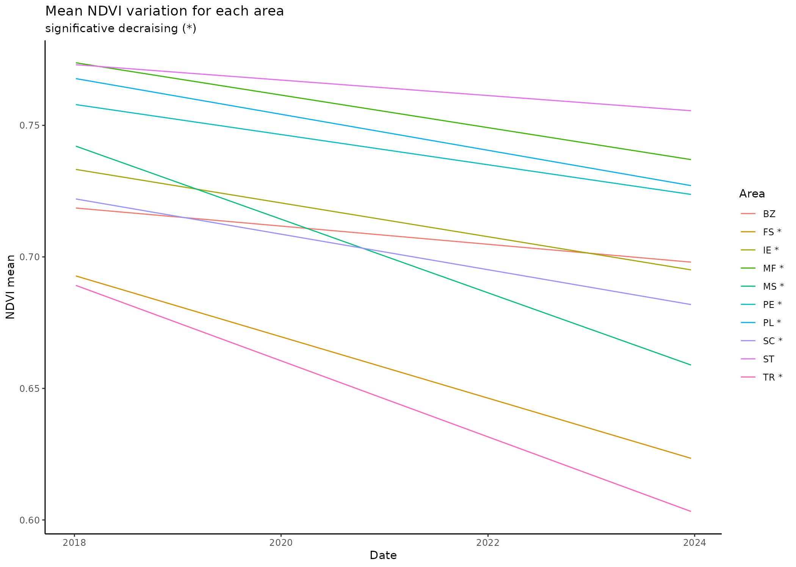
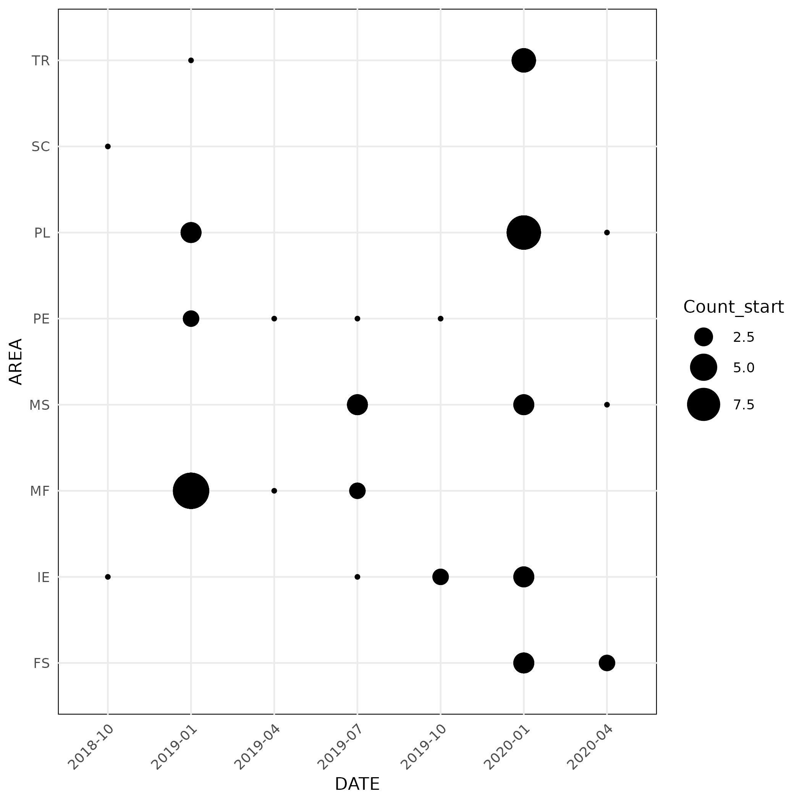
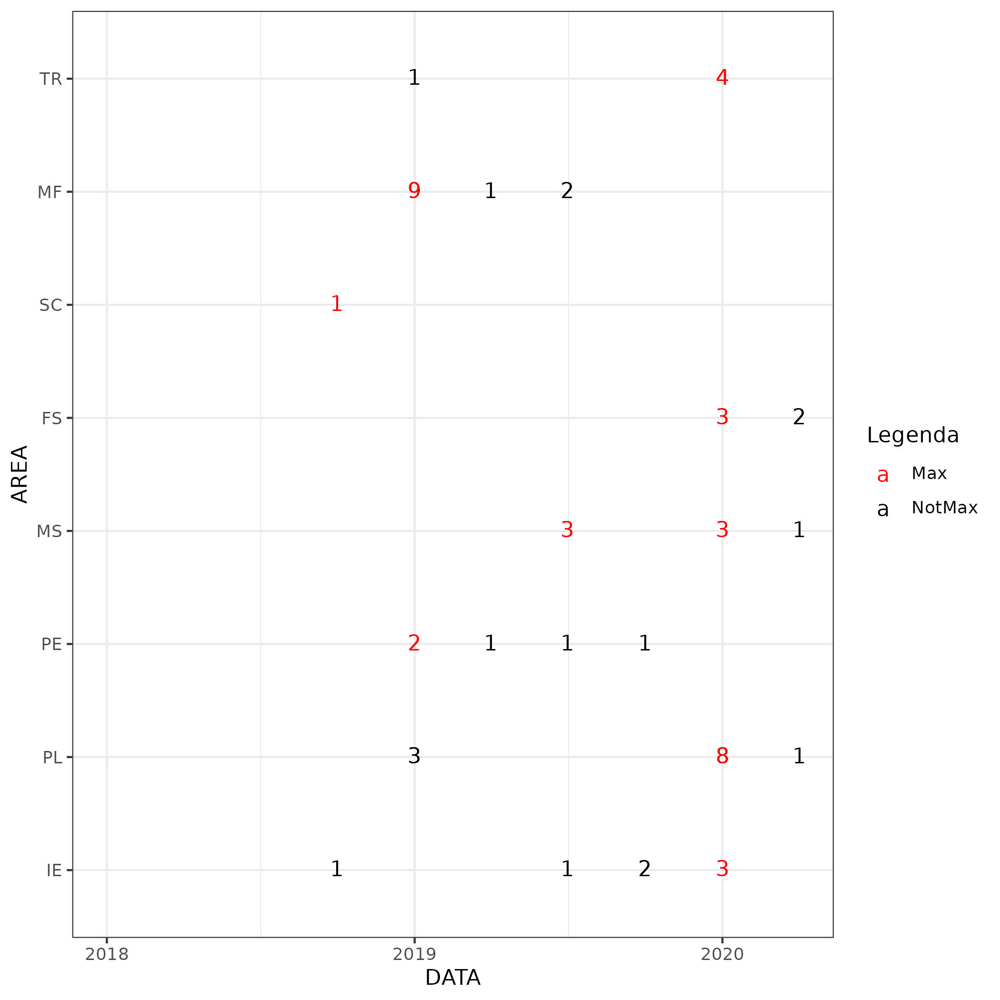

This document aims to show the process using R studio for analyse and extract the NDVI values for each pixel inside the wild olive crowns polygons. The satellite images are form Multispectral PlanetScope images (RGB + NIR bands) whit a resolution of 3 m. The pixel extracted must be inside the crowns polygons at least for 2/3 of of its extension.
The selected tree are located inside 10 different experimental plots.

------------------------------------------------------------------------

### **Prepare the crowns file**

```{r Prepare the crowns file_1, message= FALSE, warning= FALSE}
# Load all the necessary packages
library(sf)
library(dplyr) 
```

```{r Prepare the crowns file_2, eval=FALSE}
# Load all the necessary files
crowns0 <- st_read("./INPUT/VECTOR/crowns.gpkg")
```

```{r Prepare the crowns file_3, eval=FALSE}
# Project the crowns feature
crowns <- st_transform(crowns0, crs = "+proj=utm +zone=32 +datum=WGS84 +units=m +no_defs")

# Split the crowns object by area
crowns_list <- split(crowns, crowns$AREA)

folder_path <- "./ELABORATIONS/CROWNS_AREA/"

# Lista dei file presenti nella cartella
files_to_delete <- list.files(folder_path, full.names = TRUE)

# Elimina i file esistenti
if (length(files_to_delete) > 0) {
  unlink(files_to_delete)
}

# Salva un file gpkg per ciascuna area
for (i in seq_along(crowns_list)) {
  area_name <- names(crowns_list)[i]
  file_name <- paste0(folder_path, area_name, ".gpkg")
  st_write(crowns_list[[i]], file_name, append = FALSE)
}

# Save one gpkg file for each area
for (i in seq_along(crowns_list)) {
  area_name <- names(crowns_list)[i]
  file_name <- paste0("./ELABORATIONS/CROWNS_AREA/", area_name, ".gpkg")
  st_write(crowns_list[[i]], file_name, append = FALSE)
}
```

```{r Prepare the crowns file_4, eval=FALSE}
# Clean the R enviroment
rm(list=ls())
```

------------------------------------------------------------------------

### **Calculate the NDVI for each area**

```{r, eval=FALSE}
library(terra); library(progress); library(stringr)
```

```{r, eval=FALSE}
# Set the images folder
images_folder <- "./INPUT/RASTER/IMAGES/IMAGES_CLIPPED"
output_folder <- "./OUTPUT/RASTER/1_NDVI"

# Lista dei file presenti nella cartella
files_to_delete <- list.files(output_folder, full.names = TRUE)

# Elimina i file esistenti
if (length(files_to_delete) > 0) {
  unlink(files_to_delete)
}

# Ottieni la lista dei file nella cartella
file_list <- list.files(path = images_folder, pattern = "\\.tif$", full.names = TRUE)

# Funzione per calcolare l'NDVI
calculate_ndvi <- function(image_path) {
  # Carica l'immagine
  raster_data <- rast(image_path)
  
  # Presupponendo che le bande siano rispettivamente la 4 (NIR) e la 3 (Red)
  nir_band <- raster_data[[4]]
  red_band <- raster_data[[3]]
  
  # Calcola l'NDVI
  ndvi <- (nir_band - red_band) / (nir_band + red_band)
  
  # Salva l'NDVI
  output_path <- file.path(output_folder, paste0("NDVI_", basename(image_path)))
  terra::writeRaster(ndvi, output_path, overwrite = TRUE)
  
  return(output_path)
}

# Inizializza la barra di progresso
progress_bar <- progress_bar$new(
  format = "  Calcolo NDVI [:bar] :percent in :elapsed",
  total = length(file_list), 
  clear = FALSE, 
  width = 60
)

# Itera su tutti i file per calcolare e salvare l'NDVI con barra di progresso
ndvi_files <- sapply(file_list, function(file) {
  result <- calculate_ndvi(file)
  progress_bar$tick()
  return(result)
})

# Ottieni la lista dei file nella cartella
file_list_ndvi <- list.files(path = output_folder, pattern = "\\.tif$", full.names = TRUE)

# Visualizza i nomi dei file NDVI creati
# print(file_list_ndvi)
```

```{r, eval=FALSE}
# Delete del _MERGED name in the file names

# Set della cartella di output
output_folder <- "./OUTPUT/RASTER/2_NDVI_RENAMED"

# Lista dei file presenti nella cartella
files_to_delete <- list.files(output_folder, full.names = TRUE)

# Elimina i file esistenti
if (length(files_to_delete) > 0) {
  unlink(files_to_delete)
}

input_folder <- "./OUTPUT/RASTER/1_NDVI"

# Ottieni la lista dei file NDVI nella cartella di output
file_list_ndvi <- list.files(path = input_folder, pattern = "\\.tif$", full.names = TRUE)

# Funzione per rinominare i file rimuovendo il suffisso _MERGED
rename_files <- function(file_path) {
  # Estrai il nome del file senza percorso
  file_name <- basename(file_path)
  
  # Rimuovi il suffisso _MERGED dal nome del file
  new_file_name <- str_replace(file_name, "_MERGED", "")
  
  # Crea il nuovo percorso completo per il file rinominato
  new_file_path <- file.path(output_folder, new_file_name)
  
  # Rinominare il file
  file.rename(file_path, new_file_path)
  
  return(new_file_path)
}

# Itera su tutti i file per rinominarli
renamed_files <- sapply(file_list_ndvi, rename_files)

# Ottieni la lista dei file NDVI nella cartella di output
file_list_ndvi <- list.files(path = output_folder, pattern = "\\.tif$", full.names = TRUE)

# file_list_ndvi
```

```{r, eval=FALSE}
# Libreria necessaria
library(terra)

# Set della cartella di output
input_folder <- "./OUTPUT/RASTER/2_NDVI_RENAMED"

output_folder <-"./OUTPUT/RASTER/3_NDVI_STACK"

# Lista dei file presenti nella cartella
files_to_delete <- list.files(output_folder, full.names = TRUE)

# Elimina i file esistenti
if (length(files_to_delete) > 0) {
  unlink(files_to_delete)
}

# Ottieni la lista dei file NDVI nella cartella di input
file_list_ndvi <- list.files(path = input_folder, pattern = "\\.tif$", full.names = TRUE)

# Funzione per creare uno stack per un'area specifica
create_stack <- function(area_name) {
  # Filtra i file per l'area specifica
  area_files <- file_list_ndvi[grepl(area_name, file_list_ndvi)]
  
  # Carica i raster corrispondenti
  raster_stack <- rast(area_files)
  
  return(raster_stack)
}

# Trova tutte le aree uniche presenti nei nomi dei file
unique_areas <- unique(sub(".*/NDVI_(.*)_.*", "\\1", file_list_ndvi))


# Creare una lista per conservare gli stack
area_stacks <- list()

# Loop attraverso ogni area e creare uno stack delle immagini corrispondenti
for (area in unique_areas) {
  # Filtrare i file che corrispondono all'area corrente
  area_files <- file_list_ndvi[grepl(paste0("NDVI_", area, "_"), file_list_ndvi)]
  
  # Caricare le immagini e creare lo stack
  area_stack <- rast(area_files)
  
  # Aggiungere lo stack alla lista
  area_stacks[[area]] <- area_stack
}

# Salva gli stack per ogni area nella cartella desiderata
for (i in seq_along(area_stacks)) {
  area_name <- unique_areas[i]
  output_path <- file.path(output_folder, paste0("NDVI_", area_name, ".tif"))
  writeRaster(area_stacks[[i]], filename = output_path, overwrite = TRUE)
}

# Visualizza i percorsi dei file stack creati
stack_files <- list.files(path = output_folder, pattern = "\\.tif$", full.names = TRUE)
print(stack_files)
```

```{r Crop the NDVI raster file_3, eval=FALSE}
# Clean the R enviroment
rm(list=ls())
```

------------------------------------------------------------------------

### **Rename the raster layer**

In this section the layer of all the raster file are renominated with the satellite images dates.

```{r Rename the raster layer_1, message=FALSE, warning=FALSE, eval=FALSE}
# Load the required libraries
library(sf)
library(terra)
library(readr)
library(dplyr)
```

```{r Rename the raster layer_2, eval=FALSE}
# Set the cropped raster file folder
raster_folder0  <- "./OUTPUT/RASTER/3_NDVI_STACK"

# List files in the folders
raster_files0 <- list.files(raster_folder0, pattern = ".tif$", full.names = TRUE)

# Set the raster file folder
output_folder0 <- "./ELABORATION/RASTER/4_NDVI_STACK_RENAMED"

# Lista dei file presenti nella cartella
files_to_delete <- list.files(output_folder0, full.names = TRUE)

# Elimina i file esistenti
if (length(files_to_delete) > 0) {
  unlink(files_to_delete)
}
```

```{r Rename the raster layer_3, eval=FALSE}
library(terra)

# Cartella contenente i raster stack
stack_folder <- "./OUTPUT/RASTER/3_NDVI_STACK"

# Nuova cartella di output
output_folder <- "./OUTPUT/RASTER/4_NDVI_STACK_RENAMED"

# Assicurati che la cartella di output esista, altrimenti creala
if (!file.exists(output_folder)) {
  dir.create(output_folder, recursive = TRUE)
}

# Ottieni la lista dei file nella cartella
file_list <- list.files(path = stack_folder, pattern = "\\.tif$", full.names = TRUE)

# Rinomina i layer all'interno di ciascun raster stack
for (file_path in file_list) {
  # Carica il raster stack
  rst <- rast(file_path)
  
  # Ottieni i nomi dei layer nel raster stack
  layer_names <- names(rst)
  
  # Funzione per rinominare il layer con la data nel formato "YYYY-MM-DD"
  rename_layer <- function(layer_name) {
    # Estrai la parte del nome del layer corrispondente alla data
    date_str <- sub("(\\d{4})(\\d{2})(\\d{2})_MERGED_4", "\\1-\\2-\\3", layer_name)
    
    return(date_str)
  }
  
  # Rinomina tutti i layer nel raster stack
  new_layer_names <- lapply(layer_names, rename_layer)
  
  # Assegna i nuovi nomi ai layer nel raster stack
  names(rst) <- new_layer_names
  
  # Costruisci il nuovo percorso per il file di output nella nuova cartella
  output_path <- file.path(output_folder, basename(file_path))
  
  # Salva il raster stack con i nuovi nomi dei layer
  writeRaster(rst, filename = output_path, overwrite = TRUE)
  
  print(paste("Rinominati i layer per il file:", file_path))
}

# Ottieni la lista dei file nella cartella
file_list <- list.files(path = output_folder, pattern = "\\.tif$", full.names = TRUE)

file_list
```

```{r Rename the raster layer_4, eval=FALSE}
# Clean the R enviroment
rm(list=ls())
```

------------------------------------------------------------------------

### **Extraxct the NDVI pixels**

In this section the pixel values from inside, at least for 2/3 of their extension, of the crowns polygons are extracted. The new files are converted in shp format.

```{r Extraxct the NDVI pixels_1, eval=FALSE}
# Set the path to the shapefile and raster file
shapefile_folder  <- "./ELABORATIONS/CROWNS_AREA"
raster_folder  <- "./OUTPUT/RASTER/4_NDVI_STACK_RENAMED"
output_folder <- "./OUTPUT/VECTOR/NDVI_EXTRACTED"
```

```{r Extraxct the NDVI pixels_2, eval=FALSE}
# Lista dei file presenti nella cartella
files_to_delete <- list.files(output_folder, full.names = TRUE)

# Elimina i file esistenti
if (length(files_to_delete) > 0) {
  unlink(files_to_delete)
}
```


```{r Extraxct the NDVI pixels_3, eval=FALSE}
# List files in the folders
raster_files <- list.files(raster_folder, pattern = ".tif$", full.names = TRUE)
shapefile_files <- list.files(shapefile_folder, pattern = ".gpkg$", full.names = TRUE)
```

```{r Extraxct the NDVI pixels_4, eval= FALSE}
# Iterate through files
for (i in 1:length(raster_files)) {
  shp0 <- vect(shapefile_files[i])
  rast <- terra::rast(raster_files[i])

  # Extract raster values
  ex <- terra::extract(rast, shp0, method = "simple", exact = TRUE, xy = TRUE, ID = FALSE)
  
  # Convert shp from spatvector to sf object
  shp <- st_as_sf(shp0, crs = 32632)

  # If you want to convert the area to another unit, you can use the st_transform function
  shp$estensione <- st_area(st_transform(shp, crs = 32632), square = TRUE) # Change new_crs to the desired coordinate system

  # Filter polygons with at least 2/3 area coverage
  ex_filtered <- ex[ex$fraction >= (2/3),]

  # Create an sf object from the filtered data
  ex_sf <- st_as_sf(ex_filtered, coords = c("x", "y"))

  # Assign WGS 84 CRS to your sf object
  ex_sf <- st_set_crs(ex_sf, 32632)

  # Remove the fraction column (no longer needed now)
  ex_sf$fraction <- NULL

  # Remove duplicate rows based on all columns
  ex_sf2 <- distinct(ex_sf)

  # Assign the CRS of ex_sf to polygons
  polygons <- st_as_sf(shp, st_crs(ex_sf2))

  # Perform spatial join based on the position of ex_sf and polygons
  sf_join <- st_join(ex_sf2, polygons)

  # Calculate square side length (3 meters)
  side_length <- 3

  # Create squares using st_buffer
  quadrat_sf <- st_buffer(sf_join, side_length / 2, endCapStyle = "SQUARE")

  # Set CRS (EPSG:32632)
  quadrat_sf <- st_set_crs(quadrat_sf, 32632)
  
  # Elimina la colonna estensione
  quadrat_sf$estensione <- NULL 
  
  # Rename columns to remove the "X" prefix
  colnames(quadrat_sf) <- gsub("^X", "", colnames(quadrat_sf))

  # Generate output filename based on the shapefile name
  area_name <- tools::file_path_sans_ext(basename(shapefile_files[i]))
  output_filename <- file.path(output_folder, paste0(area_name, "NDVI.gpkg"))

  # Write output shapefile
  st_write(quadrat_sf, output_filename, driver = "GPKG", append = FALSE)
}
```

```{r Extraxct the NDVI pixels_5, eval=FALSE}
# Clean the R enviroment
rm(list=ls())
```

------------------------------------------------------------------------

### **Prepare the NDVI extracted file**

In this section each gpkg file of the extracted pixel inside the crowns for each area are prepared. Specifically, after loading all files as sf objects, extract the dates from the file and rename all columns. This is necessary because the column names do not yet have a date-compatible format. We factor the `AREA` column. The dataset is cleared of columns no longer needed.

```{r Prepare the NDVI extracted file_1, eval = FALSE}
# Load the necessary packages
library(sf)
library(dplyr)
library(tidyr)
library(purrr)
```

```{r Prepare the NDVI extracted file_2, eval = FALSE}
# Set the input folder of the extracted ndvi files
INPUT_folder <- "./OUTPUT/VECTOR/NDVI_EXTRACTED"

# Get the list of SHP files in the folder
INPUT_shp <- list.files(path = INPUT_folder, pattern = "\\.gpkg$", full.names = TRUE)

# Caricare tutti i file SHP in una lista di oggetti sf
shp_list <- lapply(INPUT_shp, st_read)

# Definizione della funzione per rinominare le colonne
rename_sf_columns <- function(sf_obj) {
  # Identifica le colonne che iniziano con "X"
  x_columns <- grep("^X", names(sf_obj), value = TRUE)
  
  # Estrae le date dal nome delle colonne e formatta nel formato desiderato
  new_names <- format(as.Date(sub("^X", "", x_columns), format = "%Y.%m.%d"), "%Y-%m-%d")
  
  # Rinomina le colonne
  names(sf_obj)[grep("^X", names(sf_obj))] <- new_names
  
  # Ritorna l'oggetto sf con colonne rinominate
  return(sf_obj)
}

# Applica la funzione a ciascun elemento della lista
shp_list <- map(shp_list, rename_sf_columns)

# Convert the dataframes inside the list in the long format
long_format_list <- lapply(shp_list, function(shp) {
  shp %>%
    pivot_longer(
      cols = -c(geom, COD, AREA),  # Include the "geometry" colum
      names_to = "date",
      values_to = "ndvi"
    ) %>%
mutate(date = as.Date(date, format = "%Y-%m-%d"))  
})

```

Create one unique file with all the sf object inside the list and save it in the local.

```{r Prepare the NDVI extracted file_3, eval = FALSE}
# Merge all the object of the list in one unique sf object
combined_long_format <- bind_rows(long_format_list)

# specify the file directory where save the combined sf object
output_file3 <- "./OUTPUT/VECTOR/NDVI_DF/NDVI_VALUES.gpkg"

folder_path <- "./OUTPUT/VECTOR/NDVI_DF"

# Lista dei file presenti nella cartella
files_to_delete <- list.files(folder_path, full.names = TRUE)

# Elimina i file esistenti
if (length(files_to_delete) > 0) {
  unlink(files_to_delete)
}

# Save the combined sf object in shp file 
st_write(combined_long_format, output_file3, append= FALSE)
```

```{r Prepare the NDVI extracted file_4, eval=FALSE}
# Clean the R enviroment
rm(list=ls())
```

------------------------------------------------------------------------

### **Compute the mean NDVI**

In this section the NDVI mean for each date and area in calculated to show the general trend of each area.

```{r Compute the mean NDVI_1, message =FALSE, warning=FALSE}
# Load the necessary packages
library(ggplot2)
library(dplyr)
library(sf)
```

```{r Compute the mean NDVI_2, eval= FALSE}
# Set the directory of the crown NDVI values
NDVI_VALUES <- st_read("./OUTPUT/VECTOR/NDVI_DF/NDVI_VALUES.gpkg")

# Calculate the mean NDVI for each date and area
ndvi_avg_areas <- NDVI_VALUES %>%
  group_by(date, AREA) %>%
  summarise(mean_NDVI = mean(ndvi, na.rm = TRUE))

# Lista dei file presenti nella cartella
files_to_delete <-  "./OUTPUT/VECTOR/NDVI_DF/NDVI_mean_plot.gpkg"

# Elimina i file esistenti
if (length(files_to_delete) > 0) {
  unlink(files_to_delete)
}

# Save the combined sf object in a shp file
st_write(ndvi_avg_areas, "./OUTPUT/VECTOR/NDVI_DF/NDVI_mean_plot.gpkg", append= FALSE)
```

```{r Compute the mean NDVI_3, eval=FALSE}
# Structure of the file
str(ndvi_avg_areas)
```

```{r Compute the mean NDVI_4, eval=FALSE}
# Clean the R enviroment
rm(list=ls())
```

------------------------------------------------------------------------

### **Plot the NDVI mean of each area**

In this section is showed the general NDVI trend for each area using a Theil-Sen regression because it is robust at the outliers.

```{r Plot the NDVI mean of each area_1, message=FALSE, warning=FALSE, eval=FALSE}
# Load the necessary packages
library(ggplot2)
library(sf)
library(dplyr)
library(ggpubr)
library(RColorBrewer)
library(mblm)
library(lubridate)
library(readr)
```

```{r Plot the NDVI mean of each area_2, eval = FALSE}
# Set the scipen option to hight value to eliminate the esponential notation of the values
options(scipen = 999)

# Load the file of the mean NDVI values for each area.
ndvi_avg0 <- st_read("./OUTPUT/VECTOR/NDVI_DF/NDVI_mean_plot.gpkg")

# Create a new dataframe excluding the 2023 dates
ndvi_avg <- ndvi_avg0 %>%
  filter(!year(date) %in% c(2024)) # !!!!!!!!!!!!!!

areas <- unique(ndvi_avg$AREA)
write.csv(areas, file = "./OUTPUT/CSV/ndvi_avg.csv", row.names = FALSE, col.names = TRUE)

# Create a new columm for the numeric dates
ndvi_avg$date_num <- as.numeric(ndvi_avg$date - min(ndvi_avg$date))

# Group for are and calculate the Theil-Sen line for each group
results <- ndvi_avg %>%
  group_by(AREA) %>%
  do(model = mblm(mean_NDVI ~ date_num, data = .))

# Print the results
print(results)

# Extract the result of the models
model_summaries <- lapply(results$model, summary)

# Create a data frame with the coeficient e and the p values 
coefficients_df <- data.frame(
  AREA = results$AREA,
  Intercept = sapply(model_summaries, function(x) x$coefficients[1, 1]),
  Slope = sapply(model_summaries, function(x) x$coefficients[2, 1]),
  p.value = sapply(model_summaries, function(x) x$coefficients[2, 4])
)

# Add a columm to indicate if the decline is statisticaly significative
coefficients_df$Significant_Decrease <- coefficients_df$p.value < 0.05 & coefficients_df$Slope < 0

# Merge the results with the original data
data_with_results <- merge(ndvi_avg, coefficients_df, by = "AREA")

# Add one asterisk* to the areas names with a significative trend decline
data_with_results$AREA <- ifelse(data_with_results$Significant_Decrease, paste0(data_with_results$AREA, " *"), data_with_results$AREA)

# Calculate the predicted values
data_with_results$predicted_NDVI <- with(data_with_results, Intercept + Slope * date_num)

# Create the graphg
p1 <- ggplot(data_with_results, aes(x = date, y = mean_NDVI, color = AREA)) +
  geom_line(aes(y = predicted_NDVI)) +
  labs(title = "Mean NDVI variation for each area",
       subtitle = "significative decraising (*)",
      x = "Date", y = "NDVI mean", color = "Area") +
  theme_classic()

# Elimina il file se già presente
files_to_delete <-  "./GRAPHS/NDVI_means_area1.jpg"

# Elimina i file esistenti
if (length(files_to_delete) > 0) {
  unlink(files_to_delete)
}

# Save the graph in the desired directory
ggsave(files_to_delete, plot = p1, dpi = 200, width = 2100, height = 1499, units = "px")
```



The graph show graphically the mean ndvi trend of each area. The pound symbol indicates areas where the change in trend is significant

```{r Plot the NDVI mean of each area_3, eval=FALSE}
# Create one separate graph for each area and show the regression straight line equation 
p2 <- ggplot(data = data_with_results, aes(x = date, y = mean_NDVI, group = AREA)) +
  geom_line(aes(y = predicted_NDVI)) +
  geom_point(aes(y = predicted_NDVI)) +
  facet_wrap(~AREA) +
  labs(title = "Mean NDVI variation for each area",
       subtitle = "significative decraising (*)",
      x = "Date", y = "NDVI mean", color = "Area") +
  theme_classic()

# Elimina il file se già presente
files_to_delete <-  "./GRAPHS/NDVI_means_area2.jpg"

# Elimina i file esistenti
if (length(files_to_delete) > 0) {
  unlink(files_to_delete)
}

# Save the graph in the desired directory
ggsave(files_to_delete, plot = p2, dpi = 200, width = 2100, height = 1499, units = "px")
```


```{r Plot the NDVI mean of each area_4, eval=FALSE}
# Clean the R enviroment
rm(list=ls())
```

------------------------------------------------------------------------

### **Prepare the crowns polygons**

In this section the crowns polygon files are prepared by combining the different crowns file from each different area.

```{r Prepare the crowns polygons_1, eval = FALSE}
# Set the shapefile foler of all the crowns polygons files.
shapefile_folder  <- "./ELABORATIONS/CROWNS_AREA"

# Create a list of the files inside the shapefile folder
shapefile_files <- list.files(shapefile_folder, pattern = ".gpkg$", full.names = TRUE)

# Read and combine all shapefiles
crowns0 <- lapply(shapefile_files, st_read)

# Combine the data
crowns <- bind_rows(crowns0)
st_crs(crowns) <- 32632 # set the EPSG 32632 reference system

# Elimina il file se già presente
file <-  "./ELABORATIONS/CROWNS_MERGED/crowns_merged.gpkg"

# Elimina i file esistenti
if (length(file) > 0) {
  unlink(file)
}

# Save the new crowns file 
st_write(crowns, file, append = FALSE)
```

```{r Prepare the crowns polygons_4, eval=FALSE}
# Clean the R enviroment
rm(list=ls())
```

------------------------------------------------------------------------

### **Start the elaboration for individual Tree crowns**

In this section, the analysis focuses on individual tree canopies rather than the average values of areas. The goal is to obtain a new dataframe containing plant codes and the slope of the Theil-Sen linear regression equation for the NDVI trend.

```{r Start the elaboration for individual Tree crowns_1, eval = FALSE}
# Load the necessary packages
library(tidyverse)
library(sf)
library(dplyr)
library(mblm)
```

```{r Start the elaboration for individual Tree crowns_2, eval = FALSE}
# Load the crowns file and the pixel file in shp format
crowns <- st_read("./ELABORATIONS/CROWNS_MERGED/crowns_merged.gpkg", crs = 32632)

NDVI_VALUES_0 <- st_read("./OUTPUT/VECTOR/NDVI_DF/NDVI_VALUES.gpkg", crs = 32632)

# Create a new dataframe excluding the 2024 dates
NDVI_VALUES <- NDVI_VALUES_0 %>%
  filter(!year(date) %in% c(2024)) # !!!!!!!!!!!!!!!!

# Compute the mean NDVI for each data e COD
ndvi_aggregated <- NDVI_VALUES %>%
  group_by(COD, date) %>%
  summarise(ndvi = mean(ndvi))

# Perform join based on COD column
joined_df <- crowns %>%
  st_join(ndvi_aggregated %>% dplyr::select(geom, date, ndvi), by = "COD")

# Remove the NA values rowns
cleaned_df <- na.omit(joined_df)

# Filter data so that each COD has exactly 72 rows (MONTHS)
filtered_df <- cleaned_df %>%
  group_by(COD) %>%
  slice(1:72) # !!!!!!!!!!!!!!!!!! NUMERO DI MESI

# Elimina il file se già presente
file <- "./OUTPUT/VECTOR/NDVI_DF/merged_data_ndvi.gpkg"

# Elimina i file esistenti
if (length(file) > 0) {
  unlink(file)
}

# Save the combined sf object in the shapefile
st_write(filtered_df, file, append= FALSE)
```

```{r, eval=FALSE}
# Clean the R enviroment
rm(list=ls())
```

------------------------------------------------------------------------

### **Compute the Theil-Sen regression**

In this section, a **Theil-Sen median regression** was performed using the mblm() package within the R Studio software. The Theil-Sen median method calculates slopes of lines crossing all possible pairs of points, providing a robust approach to estimate trends.

The non-parametric Theil-Sen estimator employed in this analysis is known for its robustness to outliers, a common occurrence in time series data from remote sensing. Moreover, it demonstrates resilience to non-normality, seasonality, and autocorrelation, making it a suitable choice for analyzing diverse environmental datasets. The slope and the Intercept of the line are extracted end stored in the list. Additionally, to assess the significance of the observed trend, starting from the Theil--Sen slope trends, a Mann-Kendall test was conducted. The Mann-Kendall test provides an estimation of its statistical significance by measuring the magnitude of the relationship between two successive points by distinguishing between the null hypothesis (H0) of no trend and the alternative hypothesis (H1) of the existence of a monotonic trend.

Hence, it is common practice to combine the Theil--Sen estimator with the Mann--Kendall test for a comprehensive analysis.

```{r Compute the Theil-Sen regression_1, eval=FALSE}
# Load the necessary packages
library(sf)
library(dplyr)
library(lubridate)
library(DBEST)
library(progress)
library(trend)
library(mblm)
library(RobustLinearReg)
library(readr)
```

```{r Compute the Theil-Sen regression_2, eval = FALSE}
# Load the new combinated file
NDVI_VALUES <- st_read("./OUTPUT/VECTOR/NDVI_DF/merged_data_ndvi.gpkg")
```

```{r Compute the Theil-Sen regression_3, eval=FALSE}
# Set options to prevent the use of exponential notation
options(scipen = 999)

# Get the unique COD list
cod_list <- unique(NDVI_VALUES$COD)

# Initialise a list to store results
results_list <- list()

# Create a new progress bar
pb <- progress_bar$new(total = length(cod_list))

# Run the for loop on each COD
for (cod in cod_list) {
  # Select data for current COD
  data0 <- NDVI_VALUES[NDVI_VALUES$COD == cod, ]
  
  # Convert dates to numbers (number of days from the minimum date)
  data0$date_num <- as.numeric(data0$date - min(data0$date))
  
  # Usa date_num invece di date
  theil_sen_fit <- mblm(ndvi ~ date_num, data = data0)

  slope_ts <- theil_sen_fit$coefficients[2]
  intercept_ts <- theil_sen_fit$coefficients[1]
  
  # Create the time series
  ts <- ts(data0$ndvi, start = c(2018, 1), end = c(2023, 12), frequency = 12)
  
  # Perform the non-parametric Mann-Kendall (MK) test
  mk_test <- smk.test(ts)
  
  # Save results in the list
  results_list[[cod]] <- list(intercept_ts = intercept_ts, slope_ts = slope_ts, mk = mk_test)
  
  # Update progress bar only if it has not reached the limit
  if (!pb$finished) {
    pb$tick()
  }
}

# Elimina il file se già presente
file <- "./OUTPUT/LIST/results_list.rds"

# Elimina i file esistenti
if (length(file) > 0) {
  unlink(file)
}

# Store the list
saveRDS(results_list, file = file)
```

```{r Compute the Theil-Sen regression_4, eval=FALSE}
# Clean the R enviroment
rm(list=ls())
```

------------------------------------------------------------------------

### **Creation of the results dataframe**

In this section, a results data frame was created whit all the information of the previous list.

```{r Creation of the results dataframe_1, message=FALSE, warning=FALSE}
# Load the necessary packages
library(readr)
library(dplyr)
library(progress)
```

```{r Creation of the results dataframe_2, eval = FALSE}
# Set the scipen option to a high value to eliminate exponential notation of values
options(scipen = 999)

# Load the list of the Theil-Sen coefficients an MK Test results.
results_list <- readRDS("./OUTPUT/LIST/results_list.rds")

# Initialise an empty data frame
results_df <- data.frame()

# Create a new progress bar
pb <- progress_bar$new(total = length(results_list))

# Loop through each element in results_list
for(i in 1:length(results_list)) {
  # Extract area, intercept and slope values
  COD <- names(results_list)[i]
  intercept <- results_list[[i]]$intercept_ts
  slope <- results_list[[i]]$slope_ts
  mk_p_value <- results_list[[i]]$mk$p.value

  # Create a temporary data frame with these values
  temp_df <- data.frame(COD = COD, intercept = intercept, 
                        slope = slope, mk_p_value = mk_p_value)
  
  # Add the temporary data frame to the new database
  results_df <- rbind(results_df, temp_df)
  
  # Remove line names
  rownames(results_df) <- NULL
  
 # Update progress bar only if it has not reached the limit
  if (!pb$finished) {
    pb$tick()
  }
}

# Display the new database
print(results_df)

# Add a new column for the trend class
results_df <- results_df %>%
  mutate(Trend_Class = case_when(
    slope > 0 ~ 0,
    mk_p_value > 0.05 ~ 0,
    mk_p_value <= 0.05 & mk_p_value > 0.01 ~ 1,
    mk_p_value <= 0.01 & mk_p_value > 0.001 ~ 2,
    mk_p_value <= 0.001 ~ 3
  ))

# Elimina il file se già presente
file <- "./OUTPUT/CSV/results_df_class.csv"

# Elimina i file esistenti
if (length(file) > 0) {
  unlink(file)
}

# Store the resuls_df
write_csv(results_df, file)
```

```{r Creation of the results dataframe_3, eval=FALSE}
# Clean the R enviroment
rm(list=ls())
```

```{r Creation of the results dataframe_4, message=FALSE, warning=FALSE}
# Set the scipen option to a high value to eliminate exponential notation of values
options(scipen = 999)

# Load the csv file of the results
results_df <- read_csv("./OUTPUT/CSV/results_df_class.csv")

# View a preview of the data frame
head(results_df)
```

```{r Creation of the results dataframe_5, eval=FALSE}
# Clean the R enviroment
rm(list=ls())
```

------------------------------------------------------------------------

### **DBEST alghoritm**

In this section, the Detecting Breakpoints and Estimating Segments in Trends algorithm was applied to segment and analyze shifts in the time series of NDVI. The analysis was carried out using DBEST package version 1.8 (<https://cran.r-project.org/web/packages/DBEST/index.html>, accessed 17 October 2023) into R studio software version 4.3.1. In particular the change detection algorithm was used to detects the trend changes, determines their type (abrupt or non-abrupt), and estimates their timing, magnitude, number, direction and change periods. For each time series, the dbest change detection algorithm was applied to identify statistically significant decreasing trends (α=0.05) whit the lowest magnitude to detect changes, set at 0.05.

From the dbest results, only times with a breakpoints number \> 0 and a change value \< 0 were selected. For each selected time series, the start of the decline was extracted and plotted.

```{r DBEST alghoritm_1, warning=FALSE, message=FALSE, eval=FALSE}
# Load the neccassary packages
library(DBEST)
library(sf)
library(readr)
library(progress)
library(dplyr)
library(plotly)
library(lubridate)
```

```{r DBEST alghoritm_2, eval = FALSE}
# Set the scipen option to a high value to eliminate exponential notation of values
options(scipen = 999)

# Import the dataframe 
dataframe <- read_csv("./OUTPUT/CSV/results_df_class.csv")

# Load the NDVI values shapefile
NDVI_VALUES <- st_read("./OUTPUT/VECTOR/NDVI_DF/merged_data_ndvi.gpkg")

# Extract rows where Trend_Class is different from 0
filtered_df <- subset(dataframe, Trend_Class != 0)

# Extract column 'COD' from filtered_df
cod_names_0 <- filtered_df$COD

# Initialise a list to store results
dbest_results_list_0 <- list()

# Create a new progress bar
pb <- progress_bar$new(total = length(cod_names_0))

# Loop through the values of 'COD' in cod_names_0
for (cod_value in cod_names_0) {
  # Extract data for specific 'COD' value
  data0 <- NDVI_VALUES[NDVI_VALUES$COD == cod_value, ]
  
  # Create a time series (ts)
  ts_data <- ts(data0$ndvi, start = c(2018, 1), end = c(2022, 12), frequency = 12) ##### !!!!
  
  # Apply the dbest function
  dbest <- DBEST(data=ts_data, 
                 data.type="cyclical", 
                 algorithm="change detection", 
                 change.magnitude	= 0.05, 
                 first.level.shift=0.1, 
                 second.level.shift=0.2, 
                 duration=12, 
                 distance.threshold="default", 
                 alpha=0.05, 
                 plot="on")
  
  # Store results in the new list
  dbest_results_list_0[[cod_value]] <- dbest
  
  # Update progress bar only if it has not reached the limit
  if (!pb$finished) {
    pb$tick()
  }
}

# Create a new empty list for filtered items
dbest_results_list <- list()

# Loop through the elements of the original list
for (cod_value in names(dbest_results_list_0)) {
  dbest_result <- dbest_results_list_0[[cod_value]]
  
  # Access specific values within dbest_result
  breakpoint_no <- dbest_result$BreakpointNo
  change_values <- dbest_result$Change
  
  # Check filter criteria based on BreakpointNo and Change and further filter the list
  if (length(breakpoint_no) > 0 && any(breakpoint_no > 0) && any(change_values < 0)) {
    # Add the item to the new list
    dbest_results_list[[cod_value]] <- dbest_result
  }
}

# Elimina il file se già presente
file <- "./OUTPUT/LIST/dbest_results_list.rds"

# Elimina i file esistenti
if (length(file) > 0) {
  unlink(file)
}

# Store the list
saveRDS(dbest_results_list, file)
```

```{r DBEST alghoritm_3, eval=FALSE}
# Clean the R enviroment
rm(list=ls())
```

```{r DBEST alghoritm_4, eval = FALSE}
# Load the new list
dbest_results_list <- readRDS("./OUTPUT/LIST/dbest_results_list.rds")

# Initialize a list to store the dates of greatest negative variation
negative_change_dates <- list()

# Loop through dbest results
for (cod_value in names(dbest_results_list)) {
  # Extract dbest results for the specific value of 'COD'
  dbest <- dbest_results_list[[cod_value]]
  
  # Exclude index referring to the date 2018-01
  dbest$f_local[1] <- NA
  
  # Find the index of the largest negative change at the beginning
  min_change_index_start <- which.min(dbest$f_local)
 
  # Calculates the year and month corresponding to the start index
  year_start <- floor((min_change_index_start - 1) / 12) + 2018
  month_start <- ((min_change_index_start - 1) %% 12) + 1
  
  # Store start and end dates in list
  negative_change_dates[[cod_value]] <- list(
    start = paste(year_start, month_start, sep = "-")
    )
}

# Elimina il file se già presente
file <- "./OUTPUT/LIST/negative_change_dates.rds"

# Elimina i file esistenti
if (length(file) > 0) {
  unlink(file)
}

# Store the list
saveRDS(negative_change_dates, file)

#### Extract the date from the dataframe
NDVI_VALUES <- st_read("./OUTPUT/VECTOR/NDVI_DF/merged_data_ndvi.gpkg")

# Estrai le date uniche
dates <- unique(NDVI_VALUES$date)

# Converti le date in un dataframe
dates_df <- data.frame(date = dates)

# Filtra le date rimuovendo quelle del 2023
filtered_dates <- dates_df %>%
  filter(!year(date) %in% c(2023, 2024)) # !!!!!!!!!!!!!!

# Convert in date format the column date
filtered_dates$date <- as.Date(filtered_dates$date) 

# Create a new colum named YearMonth
filtered_dates$YearMonth <- format(filtered_dates$date, "%Y-%m")

dates <- filtered_dates

# Create an empty list to save graphics
plot_list <- list()

# Create a new progress bar
pb <- progress_bar$new(total = length(negative_change_dates))

# Iteration on each list element
for (i in names(dbest_results_list)) {
  
  # Extract the current element
  current_element <- dbest_results_list[[i]]
  
  # Extracting the trend
  fitted_trend <- current_element$Trend
  
  # Create a dataframe with the original trend data and NDVI
  df <- data.frame(Time = dates$date, Trend = as.numeric(fitted_trend))

  # Create the graph with ggplot
  p <- ggplot(df, aes(x = Time)) +
    geom_line(aes(y = Trend), color = "blue") +
    ggtitle(i) +
    ylim(0.4, 0.8)
  
  # Extract the date of the negative change for the current element
  if (i %in% names(negative_change_dates)) {
    negative_change_date <- as.Date(paste0(negative_change_dates[[i]], "-01"), format = "%Y-%m-%d")
    
    # Create a separate dataframe for the date of the negative change
    df_change <- data.frame(Time = negative_change_date)
    
    # Add the dataframe to the graph as another layer
    p <- p + geom_vline(data = df_change, aes(xintercept = Time), color = "red", linetype = "dashed")
  }

  # Save the graph in the list
  plot_list[[i]] <- p
  
  # Update progress bar only if it has not reached the limit
  if (!pb$finished) {
    pb$tick()
  }
}
```

```{r DBEST alghoritm_5, eval=FALSE}
# Clean the R enviroment
rm(list=ls())
```

```{r DBEST alghoritm_6, eval=FALSE}
# Load the list of the ndvi negative change dates
negative_change_dates <- readRDS("./OUTPUT/LIST/negative_change_dates.rds")

# Create an empty vector for element names
element_names <- c()

# Create an empty vector for change dates
start_dates <- c()

# Iteration on each list element
for (i in names(negative_change_dates)) {
  
  # Add element name to name vector
  element_names <- c(element_names, i)
  
  # Extract start and end dates from the current list item
  current_dates <- negative_change_dates[[i]]
  
  # Add start and end dates to date vectors
  start_dates <- c(start_dates, current_dates$start)
}
# Create a new dataframe with element names and change dates
final_dataframe <- data.frame(COD = element_names, start = start_dates)

# Remove the last _ and numbers from the COD column to extract the area name
final_dataframe$AREA <- sub(".*_(..)$", "\\1", final_dataframe$COD)

# Lista dei file presenti nella cartella
file <-  "./OUTPUT/CSV/finaldataframe.csv"

# Elimina i file esistenti
if (length(file) > 0) {
  unlink(file)
}

# Store the final dataframe
write_csv(final_dataframe, file)
```

```{r DBEST alghoritm_7, message=FALSE, warning=FALSE, echo = FALSE}
# Load the final dataframe
final_dataframe <- read_csv("./OUTPUT/CSV/finaldataframe.csv")

# View a preview of the final dataframe
final_dataframe
```

```{r DBEST alghoritm_8, eval=FALSE}
# Clear the R enviroment
rm(list=ls())
```

------------------------------------------------------------------------

### **Plot the dates**

In this section are made some graphics about the negative change period for each area.

```{r, eval=FALSE}
# library(sf)
library(dplyr)
library(lubridate)
library(progress)
library(readr)
library(ggplot2)
library(plotly)
```

```{r, warning = FALSE, message=FALSE, eval = FALSE}
final_dataframe <- read_csv("./OUTPUT/CSV/finaldataframe.csv")

final_dataframe$...1 <- NULL

# Concatena COD e Dt_Cnvr in una singola stringa per il popup
final_dataframe$PopupText <- paste("COD:", final_dataframe$COD, "<br>",
                                   "ChangeDate:", final_dataframe$ChangeDate)

final_dataframe$start <- ym(final_dataframe$start)

# Estrai solo l'anno e il mese dalla colonna "start"
final_dataframe$start <- substr(final_dataframe$start, 1, 7)

# Calcola il conteggio di ogni combinazione di 'ChangeDate' e 'AREA'
final_dataframe <- final_dataframe %>%
  group_by(start, AREA) %>%
  mutate(Count_start = n()) %>%
  ungroup() 

# Crea il tuo grafico ggplot2
p <- ggplot(data = final_dataframe, aes(x = start, y = AREA)) +
  geom_point(aes(size = Count_start)) + 
  labs(x = "DATE", y = "AREA") +
  scale_size(range = c(1,10)) + 
  theme_minimal() +
  theme(panel.background = element_rect(fill = "white"),
        axis.text.x = element_text(angle = 45, hjust = 1))

# Lista dei file presenti nella cartella
file <-  "./GRAPHS/plot_date1.jpg"

# Elimina i file esistenti
if (length(file) > 0) {
  unlink(file)
}

# Salva il tuo grafico nella directory desiderata
ggsave(file, plot = p)
```



```{r, warning=FALSE, message = FALSE, eval = FALSE}
# Crea una nuova colonna 'IsMax' che indica se il conteggio è il massimo per ogni 'AREA'
final_dataframe <- final_dataframe %>%
  group_by(AREA) %>%
  mutate(IsMax = ifelse(Count_start == max(Count_start), "Max", "NotMax")) %>%
  ungroup()

final_dataframe$start_date <- lubridate::ym(final_dataframe$start)

write_csv(final_dataframe, "./OUTPUT/CSV/final_dataframe.csv" )

# Assicurati che 'AREA' sia un fattore e ordina i livelli come desideri
final_dataframe <- final_dataframe %>%
  mutate(AREA = factor(AREA, levels = unique(AREA)))

p <- ggplot(data = final_dataframe, aes(x = start_date, y = AREA, text = PopupText)) +
  geom_text(aes(label = Count_start, color = IsMax), vjust = +0.4) +
  scale_color_manual(values = c("Max" = "red", "NotMax" = "black")) +
  labs(x = "DATA", y = "AREA", color = "Legenda") +
  theme(axis.text.x = element_text(angle = 45, hjust = 1)) +
  scale_x_date(limits = as.Date(c("2018-01-01", max(final_dataframe$start_date))), 
               date_breaks = "1 year", date_labels = "%Y") +
  theme_bw()

# Lista dei file presenti nella cartella
file <-  "./GRAPHS/plot_date2.jpg"

# Elimina i file esistenti
if (length(file) > 0) {
  unlink(file)
}

# Salva il tuo grafico nella directory desiderata
ggsave(file, plot = p)
```



```{r}
# Ripulisci l'enviroment di R
rm(list=ls())
```

------------------------------------------------------------------------

### **Prepare the files**

In this section is prepared the data frame to visualize interactively the crown trend in one maps. In particular, a the column geometry is added to the results_df_class.csv dataframe and converted to the WGS84 reference system.

```{r Prepare the files_1, message=FALSE, warning=FALSE, eval=FALSE}
# Load the necessary packages
library(tidyverse)
library(leaflet)
library(sf)
library(quadcleanR)
```

```{r Prepare the files_2, eval = FALSE}
# Load the shp file of all the crown geometries
NDVI_VALUES <- st_read("./OUTPUT/VECTOR/NDVI_DF/merged_data_ndvi.gpkg")

# Load the trend classification csv file
class <- read_csv("./OUTPUT/CSV/results_df_class.csv", col_names = T)

# Group the NDVI_VALUES dataframe by the COD column and summarise by taking only the first geometry
merged_data <- NDVI_VALUES %>%
  group_by(COD) %>%
  summarize(geometry = first(geom)) %>%
  left_join(class, by = "COD")

# Transform to WGS84
pixel_trend_wgs84 <- st_transform(merged_data, crs = 4326)

# Create a new data frame by copyng the previous
pixel_trend <- pixel_trend_wgs84
```

```{r Prepare the files_3, eval=FALSE}
# Definition of the classification function
classify_trend <- function(Trend_Class) {
  if (Trend_Class == 0) {
    return("Positive trends or trends not significantly different from the null slope")
  } else if (Trend_Class== 1) {
    return("Trends significantly negative, 0.05 > p-value > 0.01")
  } else if (Trend_Class == 2) {
    return("Trends significantly negative, 0.01 > p-value > 0.001")
  } else if (Trend_Class == 3) {
    return("Trends significantly negative, 0.001 > p-value")
  }
}

# Applying the function to the dataframe
pixel_trend$Trend_Description <- sapply(pixel_trend$Trend_Class, classify_trend)

# Convert the Trend_Description column to a character type
pixel_trend$Trend_Description <- as.character(pixel_trend$Trend_Description)

# Lista dei file presenti nella cartella
file <-  "./OUTPUT/VECTOR/TREND/pixels_trend.gpkg"

# Elimina i file esistenti
if (length(file) > 0) {
  unlink(file)
}

# Store the data frame in one shp file
st_write(pixel_trend, file, append = FALSE)
```

```{r Prepare the files_4, echo = FALSE, message = FALSE, warning = FALSE}
# Load the pixel trend shp file
pixel_trend <- st_read("./OUTPUT/VECTOR/TREND/pixels_trend.gpkg")

head(pixel_trend)
```

```{r Prepare the files_5}
# Clean the R environment
rm(list=ls())
```

------------------------------------------------------------------------

### **Load the samples shapefile**

In this section is loaded the shapefile of the root and soil samples token in the Paulilatino area.

```{r Load the samples shapefile_1, eval=FALSE}
# Loading the merged_df file to insert the sampled points into the map
sample_32632 <- st_read("./INPUT/VECTOR/DB_Samples_def.gpkg")

# Assign the CRS of ex_sf to points
sample_wgs84 <- st_transform(sample_32632, crs = st_crs("+proj=longlat +datum=WGS84"))

# Extract the coordinates using st_coordinates
coords <- st_coordinates(sample_wgs84$geom)

# Add the latitude and longitude columns to the merged_sf dataframe
sample_wgs84$lat <- coords[, 2]
sample_wgs84$long <- coords[, 1]

# Store the sample shp in wgs84 reference system
st_write(sample_wgs84, "./INPUT/VECTOR/sample_points_wgs84.gpkg", append = FALSE )
```

```{r Load the samples shapefile_2}
# Clean the R environment
rm(list=ls())
```

------------------------------------------------------------------------

### **Load the Paulilatino municipality boundaries shapefile**

In this section is loaded the Paulilatino municipality boundaries shapefile and converted to WGS84 refernce system.

```{r Load the Paulilatino municipality boundaries_1, eval=FALSE}
# Load the Paulilatino municipality boundaries shapefile
lim_paul_32632 <- st_read( "./INPUT/VECTOR/limite_amministrativo_paulilatino_32632.gpkg")

# Assign the CRS of ex_sf to points
lim_paul_wgs84 <- st_transform(lim_paul_32632, crs = 4326)

# Store the shp file 
st_write(lim_paul_wgs84, "./INPUT/VECTOR/limite_amministrativo_paulilatino_wgs84.gpkg", append = FALSE )
```

```{r Load the Paulilatino municipality boundaries_2, eval=FALSE}
# Clean the R environment
rm(list=ls())
```

------------------------------------------------------------------------

### **Load the outbreak shapefile**

```{r Load the outbreak shapefile_1, eval=FALSE}
focolai0 <- st_read("./INPUT/VECTOR/FOCOLAI.gpkg")

focolai <- st_transform(focolai0, crs = 4326)

st_write(focolai, "./INPUT/VECTOR/FOCOLAI_wgs84.gpkg", append = FALSE )
```
```{r Load the outbreak shapefile_2, eval=FALSE}
# Clean the R environment
rm(list=ls())
```

### **Load the plot shapefile**

```{r Load the plot shapefile_1, eval=FALSE}
plot0 <- st_read("./INPUT/VECTOR/plots.gpkg")

plot0 <- st_transform(plot0, crs = st_crs("+proj=longlat +datum=WGS84"))

st_write(plot0, "./INPUT/VECTOR/plot_wgs84.gpkg", append = FALSE )
```

```{r Load the plot shapefile_2, eval=FALSE}
# Clean the R environment
rm(list=ls())
```

------------------------------------------------------------------------

### **Create a interactive map**

In this section, a interactive map is created..


```{r Load the packages, message=FALSE, warning=FALSE}
# Load the necessary packages
library(dplyr)
library(leaflet.extras)
library(leaflet)
library(leaflet.extras2)
library(sf)
library(htmlwidgets)
```

```{r Load the shp files, message=FALSE, warning=FALSE}
# Imposta l'opzione scipen su un valore elevato per eliminare la notazione esponenziale dei valori
options(scipen = 999)

# Load the shp file of the crowns coefficients values 
pixel_trend <- st_read("./OUTPUT/VECTOR/TREND/pixels_trend.gpkg")

# Load the shp file of the point sample location
samples <- st_read("./INPUT/VECTOR/sample_points_wgs84.gpkg")

# Load the shp file of the administrative boundaries of Paulilatino municipality
lim_paul_wgs84 <- st_read("./INPUT/VECTOR/limite_amministrativo_paulilatino_wgs84.gpkg")

# Load the shp file of the outbreack in the Paulilatino area
focolai_wgs84 <- st_read("./INPUT/VECTOR/FOCOLAI_wgs84.gpkg")

# Load the shp file of the plots in the Paulilatino area
plots_wgs84 <- st_read("./INPUT/VECTOR/plot_wgs84.gpkg")
```

```{r Create a custom palette, message=FALSE, warning=FALSE}
# Define a custom color palette for classes
class_palette <- c("p-value > 0.05" = "#00ff00",  # Green
                   "0.05 > p-value > 0.01" = "yellow",  # Yellow-green
                   "0.01 > p-value > 0.001" = "orange",
                   "0.001 > p-value" = "red")

# Create two color factor with the custom palette and class labels
color_factor1 <- leaflet::colorFactor(palette = class_palette, levels = c("0", "1", "2", "3"))

color_factor2 <- leaflet::colorFactor(palette = class_palette, levels = c("Positive trends or trends not significantly different from the null slope", "Trends significantly negative, 0.05 > p-value > 0.01", "Trends significantly negative, 0.01 > p-value > 0.001", "Trends significantly negative, 0.001 > p-value"))

# Define the desired order of class labels
custom_order <- c("0", "1", "2", "3")

# Make sure 'Trnd_Ds' is a factor with the defined order
pixel_trend$Trend_Class  <- factor(pixel_trend$Trend_Class , levels = custom_order)

# Create a colouring function for circles
color_factor_circle <- colorFactor(
  palette = c("green", "red"),
  domain = c("+", "-")
)
```


```{r Make the intercative map, message=FALSE, warning=FALSE}
library(leaflet)
# Creazione della mappa con Leaflet
map <- leaflet(options = leafletOptions(maxZoom = 22)) %>%
  addProviderTiles("Esri.WorldImagery", group = "Imagery", options = providerTileOptions()) %>%
  addPolygons(data = lim_paul_wgs84,
              fillOpacity = 0,
              color = "black",
              weight = 2,
              group = 'Lim. Amm. Paulilatino') %>%
  addPolygons(data = focolai_wgs84,
              fillOpacity = 0,
              color = "red",
              weight = 2,
              group = 'Outbreaks') %>%
  addPolygons(data = plots_wgs84,
              fillOpacity = 0,
              color = "yellow",
              weight = 2,
              group = 'Plots') %>%
  addCircleMarkers(data = samples,
                   lng = ~long,
                   lat = ~lat,
                   fillColor = ~color_factor_circle(samples$positivo),
                   fillOpacity = 0.6,
                   popup = ~paste(":", location, "<br/>SAMPLE:", id_sample, "<br/>SYMPTOMATIC:", sin.asin, "<br/>POSITIVITY:", positivo),
                   radius = 3,
                   group = 'Samples',
                   stroke = FALSE) %>%
  addLegend(pal = color_factor_circle,
            values = samples$positivo,
            title = "Sample Positivity",
            opacity = 0.6,
            position = "bottomright")


# Add polygons with slope-based colouring
map <- map %>%
  addPolygons(data = pixel_trend,
              fillColor = ~ifelse(slope > 0, "#00ff00", color_factor1(Trend_Class)),
              color = "black",
              fillOpacity = 0.6,
              highlightOptions = highlightOptions(color = "white", weight = 2, bringToFront = TRUE),
              popup = ~paste("COD:", COD, "<br/>slope:", slope, "<br/>class:", Trend_Class, "<br/>Description:", Trend_Description),
              group = 'Crowns',
              stroke = TRUE,
              weight = 1
  ) %>%
  addLegend(title = "Trend: lm(NDVI ~ Month)",
            pal = color_factor2,
            values = pixel_trend$Trend_Description,
            opacity = 0.6,
            position = "topright"
  ) %>%
  addFullscreenControl() %>%
  addLayersControl(
    overlayGroups = c("Crowns", "Samples", "Study area Boundaries", "Outbreaks", "Plots"),    # Add the new group
    options = layersControlOptions(collapsed = TRUE)
  )

# Visualize the map
map
```

```{r Save only the map, eval=FALSE}
# Save only the map in html format
saveWidget(map, file = "./OUTPUT/MAP/map1.html", selfcontained = T)
```

```{r Clean the R enviroment, eval=FALSE}
# Clean the R enviroment
rm(list=ls())
```
